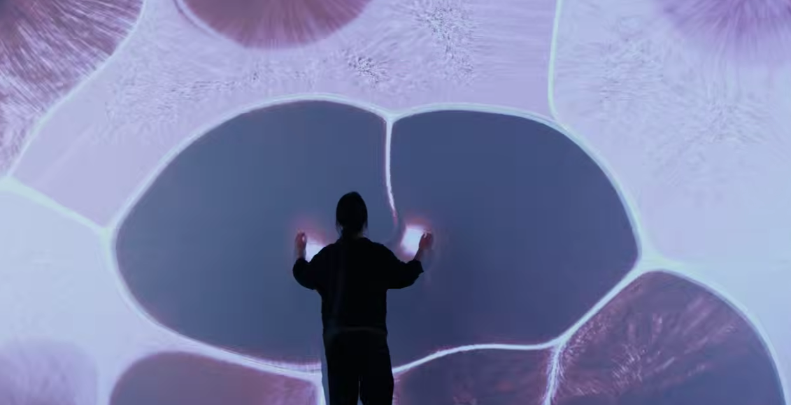
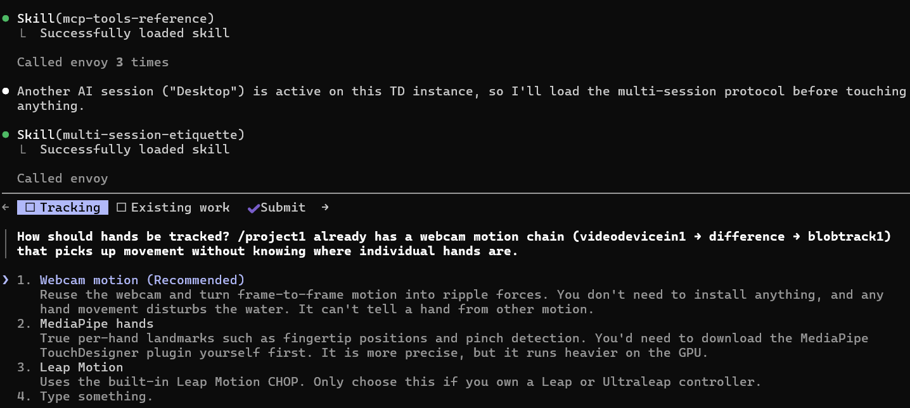
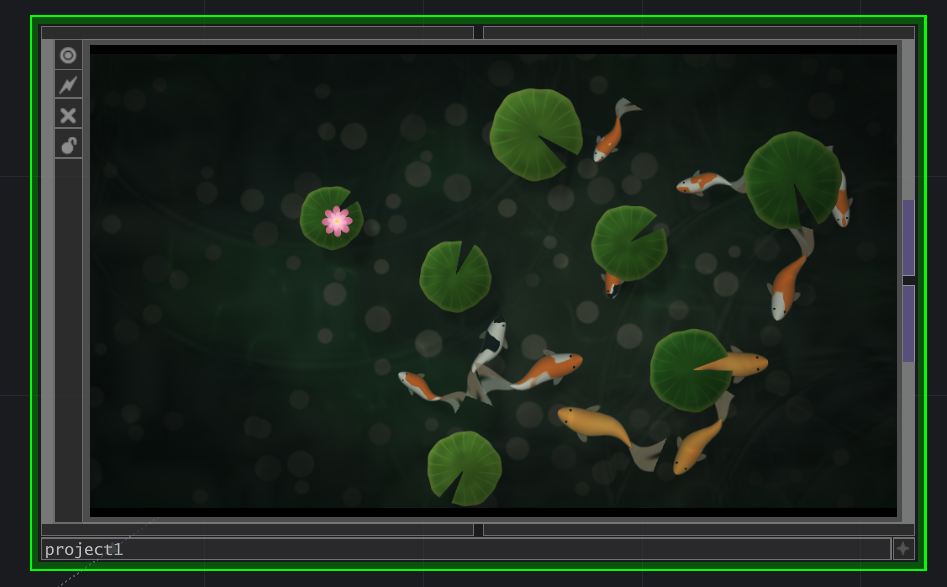
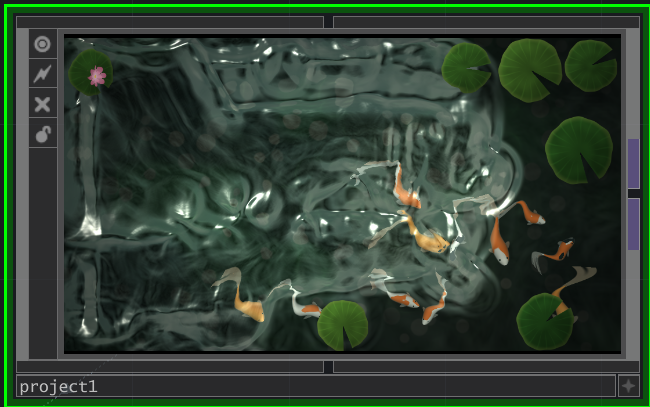
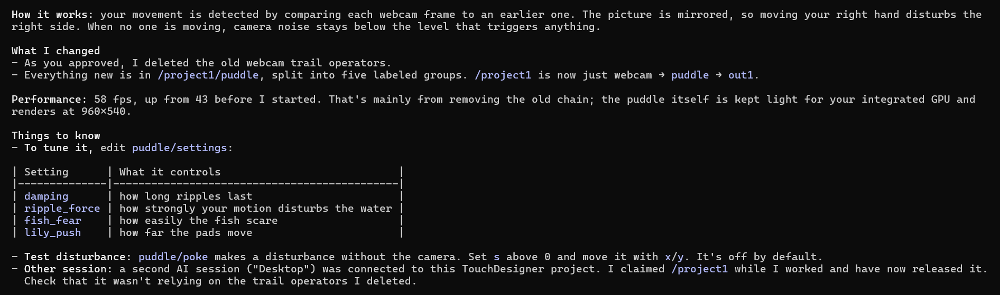

# THIS IS MY BUILD LOG

# 09/09/2026: 
I started this project.

# 09/11/2026: 
I played around with TouchDesigner. I installed the MCP & Envoy (I watched several tutorials and had to confide in ChatGPT to help me connect Claude to TouchDesigner) 

I even tried to follow a simple TouchDesigner tutorial for hand-tracking, but ended up trying Claude to design something.

# 09/18/26: 3 examples 
1. The Language of Communication (https://www.behance.net/gallery/89921413/Interactive-TouchDesigner-Kinect-Project?tracking_source=search_projects|touchdesigner&l=6)

* Concept: The closer the people are, the brighter their silhouettes become, and letters, which symbolize communication, appear.

Input: A sensor that can capture depth data and joint tracking (maybe just a webcam). 

Output: Real-time generative visuals that look like particle systems, driven and tracked by the movement between the head and the body. 

2. Music by Sonam Shah (https://www.instagram.com/musicbysonam/)

* Concept: She can control her sound output just by raising her hand.

Input: Sound

Output: A vocoder, or a synthesizer that makes her sound more robotic like.

3: The Improvisation of Water (https://www.youtube.com/watch?v=SbYtIiZdrew)

* Concept: The experiencer moves freely and feels the physical properties of water, and the digital environment spontaneously creates movement according to the experiencer's input.

Input: Sensor that tracks body movements.

Output: Real-time generated visuals of flowing, water-like particle simulations.

4: *Honorable Mention* Shrump Cam (https://www.shrump.cam/)
Input: Video
Output: A shrimp showing on your screen every time you slouch.

# 9/22/26
- I had trouble making a new .toe file. Because I have Envoy connected, when making a new file, Envoy doesn't apply to the new file. I had to duplicate my file that already had Envoy in it and have Claude reconnect to my new file. Sort of a disruption in my process, but I got it figured out! Now, my file is set up and has everything ready for Claude to play around with it in. 

- My first prompt:
❯ In this file, I would like to create an interactive puddle. I want the screen to imitate the motion of water. I want
  there to be lilypads, fish underneath the water, and other elements that can be interacted with through hand
  tracking and hand motion. I want the user to be able to disturb the water. When interacting with the water, there
  should be ripple effects and the fish underneath should be disturbed and move in reaction to the interaction.

  For now I'll be using webcam tracking, but Claude did ask me how I would like to track the hand motion and I thought MediaPipe was interesting and might use that in future use !

  

  

  First reaction: when I move my hand, the movement is WAY too intense. But I do like the rendering!

  

  

  With just one prompt, I am really impressed with the result! I love the rendering and the reflection of the water. My question now is how can I expand it and make it emotional rather than just a static environment?