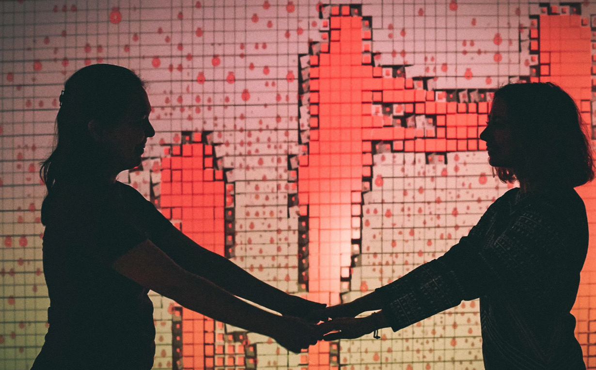
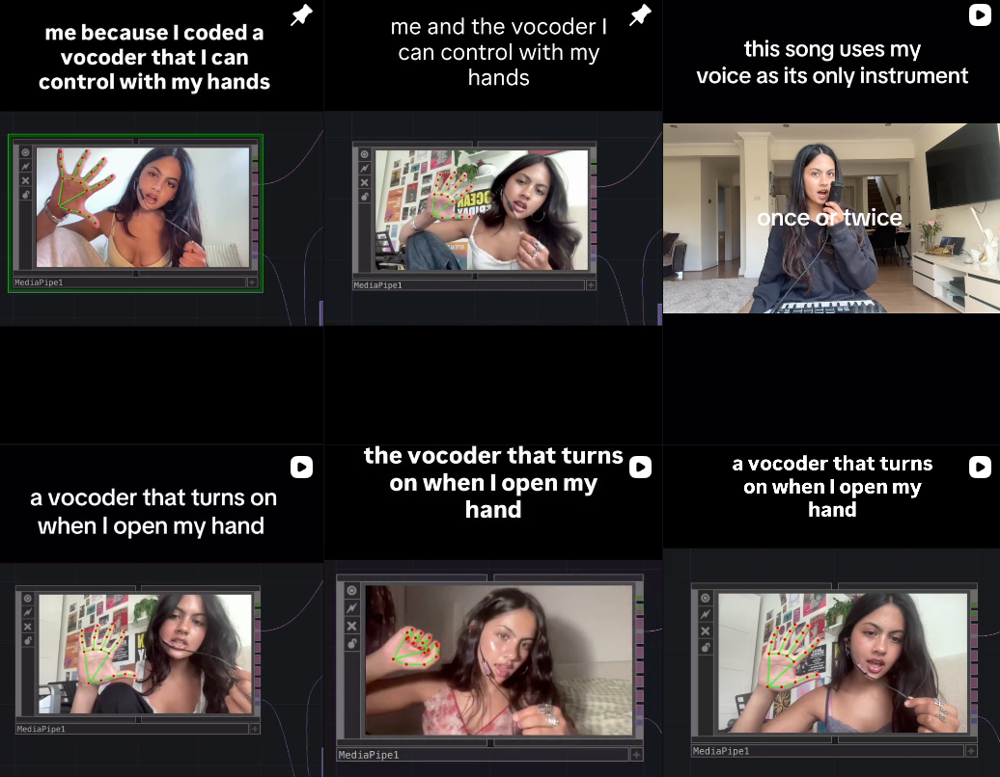

# THIS IS MY BUILD LOG

09/09/2026: I started this project.

09/11/2026: I played around with TouchDesigner. I installed the MCP & Envoy (I watched several tutorials and had to confide in ChatGPT to help me connect Claude to TouchDesigner) 

I even tried to follow a simple TouchDesigner tutorial for hand-tracking, but ended up trying Claude to design something.

09/18/26: 3 examples 
1. The Language of Communication (https://www.behance.net/gallery/89921413/Interactive-TouchDesigner-Kinect-Project?tracking_source=search_projects|touchdesigner&l=6)

* Concept: The closer the people are, the brighter their silhouettes become, and letters, which symbolize communication, appear.

Input: A sensor that can capture depth data and joint tracking (maybe just a webcam). 

Output: Real-time generative visuals that look like particle systems, driven and tracked by the movement between the head and the body. 

2. Music by Sonam Shah (https://www.instagram.com/musicbysonam/)
Concept: She can control her sound output just by raising her hand.

Input: Sound

Output: A vocoder, or a synthesizer that makes her sound more robotic like.

3: The Improvisation of Water (https://www.youtube.com/watch?v=SbYtIiZdrew)
Concept: The experiencer moves freely and feels the physical properties of water, and the digital environment spontaneously creates movement according to the experiencer's input.

Input: Sensor that tracks body movements.

Output: Real-time generated visuals of flowing, water-like particle simulations.
